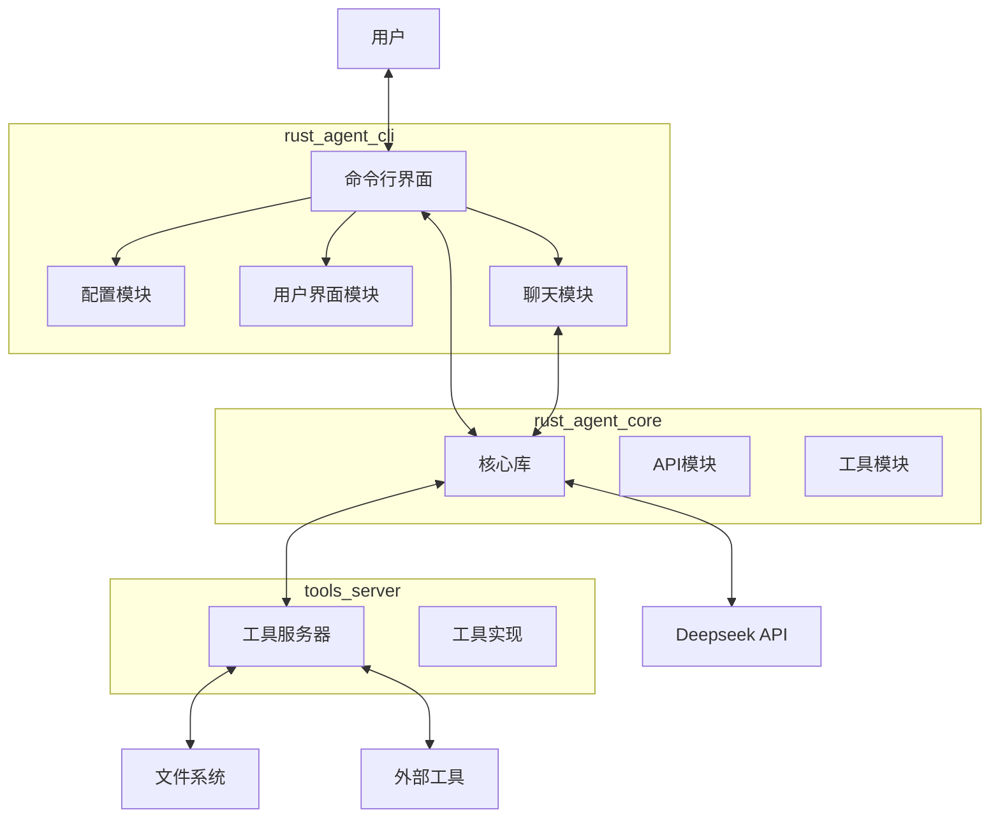

# Ad Ai Agent

一个基于Rust开发的智能代理系统，支持与大型语言模型交互并执行工具调用。

## 项目概述

Ad Ai Agent是一个模块化的智能代理系统，它允许用户通过命令行界面与大型语言模型（如Deepseek）进行对话交互，并且能够执行各种工具操作。系统由三个主要组件组成：核心库、命令行界面和工具服务器。

## 系统架构



## 主要组件

### 核心库 (rust_agent_core)

核心库提供了与大型语言模型交互的基础功能和工具调用的接口。

- **API模块**: 处理与Deepseek API的通信
- **工具模块**: 定义工具接口和RPC通信

### 命令行界面 (rust_agent_cli)

提供用户友好的命令行交互界面。

- **配置模块**: 处理命令行参数和配置
- **聊天模块**: 管理对话会话
- **UI模块**: 处理用户输入和输出显示

### 工具服务器 (tools_server)

实现各种工具功能，通过RPC与核心库通信。

- **文件分析工具 (FileAnalyzerTool)**
  - 分析目录和文件统计信息
  - 支持递归分析
  - 提供文件大小、数量和类型统计
  - 识别最大文件

- **文件处理工具 (FileTool)**
  - 文件格式转换
  - 文件压缩/解压（计划中）
  - 文件重命名（计划中）
  - 文件整理（计划中）
  - 详细的操作日志
  - 错误处理和恢复机制

- **网络搜索工具 (WebSearchTool)**
  - 基于 DuckDuckGo API 的网络搜索
  - 支持代理配置
  - 智能结果过滤
  - 相关性排序

## 功能特点

- 与Deepseek大型语言模型进行自然语言对话
- 支持工具调用，扩展AI能力：
  - 文件分析：快速获取文件和目录统计信息
  - 文件处理：支持各种文件操作和转换
  - 网络搜索：获取实时在线信息
- 模块化设计，易于扩展新功能
- 中文友好的用户界面
- 支持流式输出，实时显示AI响应
- 内置日志系统，支持调试模式
- 可配置的工具服务连接
- 智能的API密钥管理
- 优雅的错误处理机制
- 支持退出命令（quit/exit）

## 安装与使用

### 前提条件

- Rust 开发环境
- Deepseek API 密钥

### 安装

```bash
# 克隆仓库
git clone git@github.com:Adiao1973/ad-ai-agent.git
cd ad-ai-agent

# 编译项目
cargo build --release
```

### 使用方法

1. 启动工具服务器：

```bash
./target/release/tools_server
```

2. 启动命令行界面：

```bash
./target/release/rust_agent_cli
```

首次运行时，系统会提示输入Deepseek API密钥。

### 配置选项

系统支持以下配置项：

- `api_key`: Deepseek API密钥
- `tools_addr`: 工具服务器地址（默认：http://[::1]:50051）
- `verbose`: 是否启用详细输出模式

### 调试模式

在详细输出模式下，系统会显示：
- 对话历史消息数量
- 工具服务连接状态
- 其他调试信息

### 常用命令

- 启动程序：`./target/release/rust_agent_cli`
- 退出程序：输入 `quit` 或 `exit`

## 扩展开发

想要扩展新的功能，可以考虑：

1. 在 config 模块中添加新的配置选项
2. 在 api 模块中添加新的 API 调用
3. 在 ui 模块中添加新的交互方式
4. 在 chat 模块中添加新的对话管理功能
5. 在工具服务器中实现新的工具：
   - 完善文件处理工具的压缩/解压功能
   - 添加文件重命名和整理功能
   - 扩展网络搜索工具的搜索源
   - 添加新的文件分析功能

## 工具系统说明

系统中的工具是通过 AI Agent 自动调用的，用户只需要用自然语言描述需求即可。例如：

- "帮我分析一下这个目录下的文件情况"
- "将这个文件转换为 PDF 格式"
- "搜索关于 Rust 异步编程的最新信息"

AI Agent 会：
1. 理解用户意图
2. 选择合适的工具
3. 设置正确的参数
4. 执行操作
5. 返回处理结果

这种设计使得用户可以专注于表达需求，而不需要关心具体的工具使用方式。

## 许可证

[MIT License](LICENSE)
