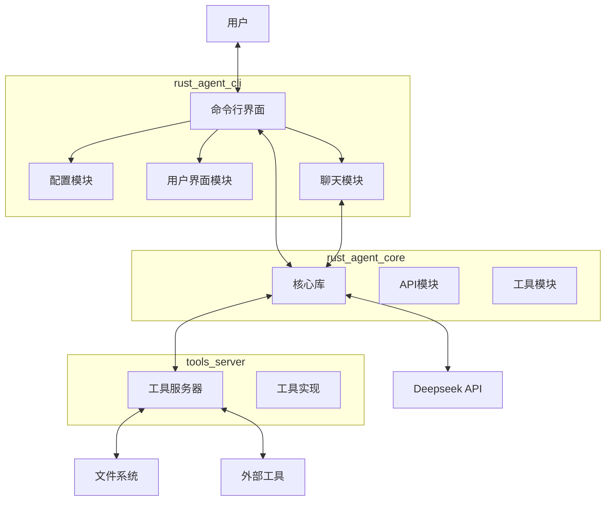

# Ad Ai Agent

一个基于Rust开发的智能代理系统，支持与大型语言模型交互并执行工具调用。

## 项目概述

Ad Ai Agent是一个模块化的智能代理系统，它允许用户通过命令行界面与大型语言模型（如Deepseek）进行对话交互，并且能够执行各种工具操作。系统由三个主要组件组成：核心库、命令行界面和工具服务器。

## 系统架构



## 主要组件

### 核心库 (rust_agent_core)

核心库提供了与大型语言模型交互的基础功能和工具调用的接口。

- **API模块**: 处理与Deepseek API的通信
- **工具模块**: 定义工具接口和RPC通信

### 命令行界面 (rust_agent_cli)

提供用户友好的命令行交互界面。

- **配置模块**: 处理命令行参数和配置
- **聊天模块**: 管理对话会话
- **UI模块**: 处理用户输入和输出显示

### 工具服务器 (tools_server)

实现各种工具功能，通过RPC与核心库通信。

- 文件分析
- 系统操作
- 其他自定义工具

## 功能特点

- 与Deepseek大型语言模型进行自然语言对话
- 支持工具调用，扩展AI能力
- 模块化设计，易于扩展新功能
- 中文友好的用户界面

## 安装与使用

### 前提条件

- Rust 开发环境
- Deepseek API 密钥

### 安装

```bash
# 克隆仓库
git clone git@github.com:Adiao1973/ad-ai-agent.git
cd ad-ai-agent

# 编译项目
cargo build --release
```

### 使用方法

1. 启动工具服务器：

```bash
./target/release/tools_server
```

2. 启动命令行界面：

```bash
./target/release/rust_agent_cli
```

首次运行时，系统会提示输入Deepseek API密钥。

## 扩展开发

想要扩展新的功能，可以考虑：

1. 在 config 模块中添加新的配置选项
2. 在 api 模块中添加新的 API 调用
3. 在 ui 模块中添加新的交互方式
4. 在 chat 模块中添加新的对话管理功能
5. 在工具服务器中实现新的工具

## 许可证

[MIT License](LICENSE)
